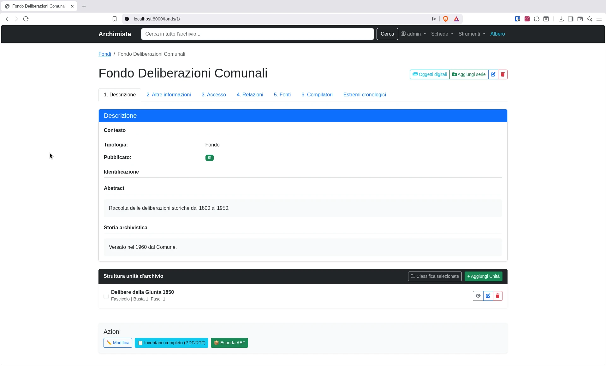

# Archimista — Porting Python/Django

Riscrittura in Python/Django di [Archimista](https://github.com/ProgettoArchimista/archimista/), software per la descrizione di archivi storici, originariamente sviluppato in Ruby on Rails.



---

## Licenza

Questo programma è **software libero**, distribuito sotto i termini della **GNU General Public License versione 2** (o successiva).

```
Archimista Python/Django — Porting del software Archimista
Copyright (C) 2026 [Dorian Soru / doriansoru (chiocciola) gmail (punto) com]

Questo programma è software libero; è lecito redistribuirlo e/o modificarlo
secondo i termini della GNU General Public License come pubblicata dalla
Free Software Foundation; versione 2 della Licenza, o (a tua scelta) qualsiasi
versione successiva.

Questo programma è distribuito nella speranza che risulti utile, ma
SENZA ALCUNA GARANZIA; senza neppure la garanzia implicita di
COMMERCIABILITÀ o IDONEITÀ PER UNO SCOPO PARTICOLARE. Vedi la GNU
General Public License per ulteriori dettagli.

Una copia della GNU General Public License è inclusa con questo software
(file LICENSE). In alternativa, visita:
https://www.gnu.org/licenses/old-licenses/gpl-2.0.html
```

Il progetto originale Archimista è Copyright © 2011–2019:

- Direzione Generale per gli Archivi
- ICAR – Istituto Centrale per gli Archivi
- Regione Lombardia, Direzione Generale Autonomia e Cultura
- Università degli Studi di Pavia
- Politecnico di Milano
- Regione Piemonte

Questo porting è un'**opera derivata** del progetto originale e deve pertanto
essere distribuito sotto la medesima licenza GPL, ai sensi dell'articolo 2
della GNU GPL v2.

---

## Crediti

### Progetto originale Archimista (Ruby on Rails)

**Promozione e finanziamento** (2018–in corso)

- [Direzione Generale per gli Archivi](http://www.regione.lombardia.it)
- [ICAR – Istituto Centrale per gli Archivi](http://www.icar.beniculturali.it/)
- [Regione Lombardia, Direzione Generale Istruzione, Formazione e Cultura](http://www.regione.lombardia.it/wps/portal/istituzionale/HP/istituzione/direzioni-generali/direzione-generale-autonomia-e-cultura)
- [Università degli Studi di Pavia](http://www.unipv.eu/site/home.html)
- [Politecnico di Milano](https://www.polimi.it/)
- [Regione Piemonte](https://www.regione.piemonte.it/)

**Sviluppo versioni 2.0.0 e 2.1.0**

- Sviluppo: [TAI S.a.s.](http://www.taisas.com/), Milano

**Comitato di pilotaggio**

- Politecnico di Milano
- Regione Lombardia, Direzione Generale Culture, Identità e Autonomie
- Soprintendenza archivistica della Lombardia

Per la cronologia completa dei contributi (2010–2018), vedere il file
[CREDITS.md](../CREDITS.md) nella repository originale.

### Porting Python/Django

**Sviluppo**: [Dorian Soru / &#x64;&#x6f;&#x72;&#x69;&#x61;&#x6e;&#x73;&#x6f;&#x72;&#x75;&#x40;&#x67;&#x6d;&#x61;&#x69;&#x6c;&#x2e;&#x63;&#x6f;&#x6d;]

**Strumenti utilizzati**: Il porting è stato sviluppato con l'assistenza di
**Qwen** (modello di intelligenza artificiale di Alibaba Cloud), che ha
supportato la riscrittura del codice, il refactoring, la scrittura dei test,
la risoluzione di bug e la documentazione. Il codice prodotto è di esclusiva
titolarità dello sviluppatore umano che ne ha guidato, verificato e validato
ogni modifica.

**Versione corrente**: v0.55.0

**Stato del porting**: tutte le funzionalità core di Archimista Ruby sono state
replicate in Python/Django, con l'aggiunta di export XML (SAN, EAD/ICAR-IMPORT,
METS), refactoring modulare dell'AEF exporter e **installer Windows standalone**
(.exe) che include Python embedded e configurazione guidata. Per il dettaglio completo delle
funzionalità implementate, vedere
[COMPLETION_STATUS.md](markdown_porting/COMPLETION_STATUS.md) e
[CHANGELOG.md](markdown_porting/CHANGELOG.md) nella directory
`markdown_porting/`.

---

## Funzionalità

### Core archivistico

- **Complessi archivistici (Fond)**: CRUD completo con 7 tab (Descrizione, Altre informazioni, Accesso, Relazioni, Fonti, Compilatori, Estremi cronologici)
- **Unità archivistiche (Unit)**: CRUD completo con classificazione, schede speciali SC2/ICCD/FSC/FE
- **Soggetti produttori (Creator)**: CRUD completo con 5+ tab
- **Soggetti conservatori (Custodian)**: CRUD completo con 7 tab
- **Progetti**: CRUD completo con responsabilità e stakeholder
- **Fonti (Source)**, **Voci di indice (Heading)**, **Anagrafiche (Anagraphic)**, **Forme documentarie (DocumentForm)**, **Profili istituzionali (Institution)**, **Compilatori (Editor)**, **Titolario (Classification)**
- **Oggetti digitali**: upload file con generazione automatica thumbnail (Pillow)

### Navigazione

- **Albero archivistico interattivo** (jsTree): espandi/collassa, rinomina, drag & drop, cestino, ripristino
- **Classificazione di massa**: seleziona più unità e spostale sotto un fondo o una classificazione

### Import/Export

- **Import AEF**: compatibilità totale con il formato di esportazione di Archimista Ruby
- **Export AEF**: round-trip completo (esporta → reimporta senza perdita di dati)
- **Export CSV**: esportazione unità con filtri
- **Export PDF/RTF**: report inventario completo identico a Ruby (29 campi Fond, 49 Unit, 18 Creator, 32 Custodian, 10 Project + schede SC2/ICCD/FSC/FE)

### Strumenti

- **Controllo qualità**: analisi completezza e consistenza dati per fondi, creatori e conservatori
- **Ricerca avanzata**: filtri multipli per tipo entità, fondo, tipo, pubblicati
- **Storico modifiche**: tracciamento di chi ha modificato cosa e quando (EditorLog)
- **Compilatori**: gestione dei curatori delle schede

### Autenticazione

- Login obbligatorio per tutte le pagine
- Cambio password obbligatorio al primo accesso
- Singolo utente amministratore (multi-utente opzionale, futuro)

---

## Requisiti

- **Python** 3.11 o superiore
- **pip** (_pip installs packages_, il gestore di pacchetti per Python)
- **SQLite** (sviluppo) / **PostgreSQL** (produzione, consigliato)
- **wkhtmltopdf** (opzionale, solo se si vuole il rendering PDF alternativo; di default si usa WeasyPrint)

---

## Installazione rapida (Linux / macOS)

### 1. Clona la repository

```bash
git clone https://github.com/doriansoru/archimista-python.git
cd archimista-python
```

### 2. Crea l'ambiente virtuale

```bash
python3 -m venv venv
source venv/bin/activate
```

### 3. Installa le dipendenze

```bash
pip install -r requirements.txt
```

### 4. Inizializza il database

Esegui lo script di setup completo:

```bash
bash setup.sh
```

Oppure, passo per passo:

```bash
python manage.py migrate
python seed_vocabularies.py
python seed_source_types.py
python seed.py              # opzionale: dati di esempio
python seed_admin_user.py   # crea l'utente admin
```

### 5. Avvia il server di sviluppo

```bash
python manage.py runserver
```

---

## Installazione rapida (Windows)

### 1. Clona la repository

Apri PowerShell:

```powershell
git clone https://github.com/doriansoru/archimista-python.git
cd archimista-python
```

### 2. Crea l'ambiente virtuale

```powershell
python -m venv venv
.\venv\Scripts\Activate.ps1
```

> **Nota:** se PowerShell blocca l'attivazione, esegui prima:
> ```powershell
> Set-ExecutionPolicy -ExecutionPolicy RemoteSigned -Scope CurrentUser
> ```

### 3. Installa le dipendenze

```powershell
pip install -r requirements.txt
```

### 4. Inizializza il database

Esegui lo script di setup:

```powershell
.\setup.bat
```

Oppure, con dati minimi (senza dati di esempio):

```powershell
.\setup.bat --no-seed
```

Oppure, passo per passo:

```powershell
python manage.py migrate
python seed_vocabularies.py
python seed_source_types.py
python seed.py              # opzionale: dati di esempio
python seed_admin_user.py   # crea l'utente admin
```

### 5. Avvia il server di sviluppo

```powershell
python manage.py runserver
```

Apri il browser su **http://127.0.0.1:8000/** ed effettua il login con le
credenziali stampate dallo script di setup.

---

## Installer Windows (.exe)

A partire dalla versione **v0.55.0**, è disponibile un sistema di build che
consente di generare un **installer Windows autonomo** (.exe) che non richiede
l'installazione preventiva di Python, pip o dipendenze. L'installer include
tutto il necessario: Python embedded, Django, tutte le librerie, file del
progetto e una procedura guidata di configurazione al primo avvio.

### Come funziona

Il processo di build ha due fasi:

1. **PyInstaller** — Bundla Python + tutte le dipendenze in un eseguibile standalone
2. **Inno Setup** — Crea un installer Windows con procedura guidata

### Come costruire l'installer (su Windows)

```cmd
REM Dalla directory python_rewrite\
build_all.bat
```

Lo script:
1. Esegue `build_installer.bat` (PyInstaller)
2. Compila `archimista_installer.iss` con Inno Setup
3. Produce `output\Archimista-Setup-0.55.0.exe`

### Cosa include l'installer

- **Python 3.x embedded** (nessuna installazione Python richiesta)
- **Django + tutte le dipendenze** (WeasyPrint, Pillow, lxml, reportlab, ecc.)
- **Tutti i file del progetto** (template, migrazioni, seed script)
- **Configurazione guidata al primo avvio**:
  - Applicazione migrazioni database
  - Popolamento vocabolari controllati
  - Popolamento tipologie di fonte
  - **Domanda interattiva**: vuoi i dati di esempio? (S/n)
  - Creazione utente admin con password temporanea
  - Avvio automatico del server e apertura browser

### Per i manutentori

| File | Scopo |
|------|-------|
| `archimista_launcher.py` | Launcher intelligente (gestisce first-run setup) |
| `archimista.spec` | Specifica PyInstaller (import, data files, esclusioni) |
| `build_installer.bat` | Script build PyInstaller (Fase 1) |
| `archimista_installer.iss` | Script Inno Setup (Fase 2) |
| `build_all.bat` | Orchestratore one-click (entrambe le fasi) |
| `requirements-build.txt` | Dipendenze di build (PyInstaller) |
| `INSTALLER_BUILD.md` | Documentazione completa del processo di build |

Per istruzioni dettagliate, vedere [INSTALLER_BUILD.md](INSTALLER_BUILD.md).

### Requisiti di build

- **Python 3.10+** (64-bit) + virtual environment con dipendenze
- **PyInstaller**: `pip install -r requirements-build.txt`
- **Inno Setup 6.x** (gratuito): https://jrsoftware.org/isdl.php

### Note

- Dimensione installer stimata: **150-300 MB** (include Python + tutte le libs)
- L'installer funziona anche senza Python installato sul sistema target
- Per testare il bundle PyInstaller senza creare l'installer: `build_installer.bat`
- Per resettare la configurazione first-run: cancellare `first_run.done` e `db.sqlite3`

---

## Installazione manuale (passo per passo)

Se preferisci controllare ogni passaggio:

```bash
# Attiva il virtual environment
source venv/bin/activate

# Crea il database
python manage.py migrate

# Popola i vocabolari controllati (30 vocabolari, 200+ termini)
python seed_vocabularies.py

# Popola le tipologie di fonte
python seed_source_types.py

# (Opzionale) Inserisci dati di esempio
python seed.py

# Crea l'utente admin
python seed_admin_user.py

# Avvia il server
python manage.py runserver
```

---

## Struttura del progetto

```
archimista-python/
├── manage.py                          # Django management script
├── requirements.txt                   # Dipendenze Python
├── requirements-build.txt             # Dipendenze di build (PyInstaller)
├── setup.sh                           # Script di inizializzazione rapida
├── db.sqlite3                         # Database SQLite (generato)
│
├── seed.py                            # Dati di esempio
├── seed_admin_user.py                 # Crea utente admin
├── seed_vocabularies.py               # Popola vocabolari controllati
├── seed_source_types.py               # Popola tipologie di fonte
├── clean_vocabularies.py              # Pulisce termini non-Ruby dai vocabolari
├── fix_sc2_card_types.py              # Fix retrocompatibilità SC2/SC3
│
├── archimista_launcher.py             # Launcher per installer Windows (v0.55.0)
├── archimista.spec                    # Specifica PyInstaller
├── archimista_installer.iss           # Script Inno Setup
├── build_installer.bat                # Build PyInstaller (Windows)
├── build_all.bat                      # Build completo one-click (Windows)
├── INSTALLER_BUILD.md                 # Documentazione installer
│
├── test_*.py                          # Script di test
│
└── archimista_python/                 # Progetto Django
    ├── settings.py                    # Configurazione Django
    ├── urls.py                        # Routing URL
    ├── middleware.py                  # Middleware (login richiesto)
    │
    └── archive/                       # App principale
        ├── models/                    # Modelli database (130+)
        │   ├── core.py                # Group, Fond, Unit, Creator, Custodian...
        │   ├── extensions.py          # Estensioni per Fond, Unit, Creator, Custodian
        │   ├── relations.py           # Modelli relazionali (Rel*)
        │   ├── sc2.py                 # Schede SC2 (disegni/foto)
        │   ├── iccd.py                # Schede ICCD (beni culturali)
        │   ├── fsc.py                 # FSC (fascicoli sanitari edilizia)
        │   ├── fe.py                  # FE (fabbricati edilizia)
        │   ├── vocabulary.py          # Term, Vocabulary
        │   └── system.py             # Institution, Source, Project, Event...
        │
        ├── forms/                     # Form Django
        │   ├── fond.py                # FondForm + formset
        │   ├── unit.py                # UnitForm + formset
        │   ├── creator.py             # CreatorForm + formset
        │   ├── custodian.py           # CustodianForm + formset
        │   ├── project.py             # ProjectForm + formset
        │   ├── source.py              # SourceForm + formset
        │   ├── institution.py         # InstitutionForm + formset
        │   ├── sc2.py, iccd.py, fsc.py, fe.py
        │   └── ...
        │
        ├── views/                     # Viste
        │   ├── fond.py                # CRUD Fondi
        │   ├── unit.py                # CRUD Unità
        │   ├── creator.py             # CRUD Creator
        │   ├── custodian.py           # CRUD Custodian
        │   ├── reports.py             # Report PDF/RTF
        │   ├── export_aef.py          # Export AEF
        │   ├── export_csv.py          # Export CSV
        │   ├── advanced_search.py     # Ricerca avanzata
        │   ├── quality_checks.py      # Controllo qualità
        │   ├── digital_objects.py     # Oggetti digitali
        │   ├── editors.py             # Compilatori
        │   ├── tree.py                # API albero
        │   └── ...
        │
        ├── templates/archive/         # Template HTML
        │   ├── base.html              # Layout base
        │   ├── fond_list.html, fond_detail.html, fond_form.html
        │   ├── unit_form.html, unit_detail.html
        │   ├── creator_*.html, custodian_*.html, project_*.html
        │   ├── units/partials/        # Partial per unità
        │   └── ...
        │
        ├── admin.py                   # Registrazione Django Admin
        ├── import_utils.py            # Import AEF
        ├── aef_exporter/              # Export AEF modulare (v0.54.0)
        │   ├── __init__.py            # Orchestratore AEFExporter
        │   ├── constants.py           # Esclusioni, tabelle, MODEL_NAME_MAP
        │   ├── serializers.py         # model_to_dict, write_record, AEFEncoder
        │   ├── fond_units.py          # Export fondi + unità
        │   ├── extensions.py          # SC2/ICCD/FSC/FE, creator/source
        │   ├── relations.py           # major_entities, headings, sources
        │   ├── digital_objects.py     # Metadata + file inclusion
        │   ├── single_entity.py       # Mode 'not-full'
        │   ├── metadata.py            # metadata.json + ZIP packaging
        │   └── xml_export.py          # SAN, EAD, METS XML generation
        ├── aef_exporter.py            # Compatibilità legacy (thin shim)
        ├── report_support.py          # Configurazione report (porting da Ruby)
        ├── rtf_writer.py              # Generatore RTF
        └── rtf_builder.py             # Builder report RTF
```

---

## Compatibilità con Archimista Ruby

| Funzionalità | Ruby originale | Python/Django |
|---|---|---|
| Modelli database | ~129 | 130+ ✅ |
| Import AEF | ✅ | ✅ Completo |
| Export AEF | ✅ | ✅ Round-trip + modulare |
| Export XML (SAN/EAD/METS) | ✅ | ✅ (v0.54.0) |
| Export PDF inventario | ✅ (wkhtmltopdf) | ✅ (WeasyPrint) |
| Export RTF | ✅ (RtfWriter) | ✅ (RtfBuilder porting) |
| Export CSV | ✅ | ✅ |
| Form unità | 6 tab | 6 tab ✅ |
| Form fondo | 6 tab | 6 tab ✅ |
| Form soggetto produttore | 5 tab | 5 tab ✅ |
| Form soggetto conservatore | 7 tab | 7 tab ✅ |
| Schede SC2/ICCD/FSC/FE | ✅ | ✅ |
| Albero interattivo | ✅ | ✅ (jsTree) |
| Vocabolari controllati | 30 | 30 ✅ |
| Controllo qualità | ✅ | ✅ |
| Autenticazione | Multi-utente | Singolo admin (v0.45.0) |
| Installer Windows (.exe) | ❌ | ✅ (v0.55.0) |

### Differenze note

- **Autocomplete relazioni**: Ruby usa ricerca AJAX (livesearch/autocomplete),
  Python usa Select2 con ricerca. Per dataset piccoli (< 20 elementi) Select2
  mostra tutte le opzioni subito senza richiedere digitazione (v0.54.0).
- **Export EAD da Ruby**: il template EAD di Ruby ha bug di nil-handling su
  dati importati da AEF Python (es. `fond_type` nil, `source_type` nil).
  Workaround: assegnare valori non-nil dalla console Ruby prima dell'export EAD.
- **Lingua**: le etichette dei form sono tradotte in italiano allineandosi a
  i18n Ruby. Non è ancora implementato il supporto multi-lingua.
- **Permessi**: attualmente singolo utente admin. Il sistema multi-utente con
  permessi per fondo/gruppo è opzionale.

---

## Troubleshooting

### Errore `no such table: archive_fond`

Il database non è stato inizializzato. Esegui:

```bash
python manage.py migrate
```

### Errore `Matching query does not exist` all'avvio

Mancano i vocabolari o i source_types. Esegui:

```bash
python seed_vocabularies.py
python seed_source_types.py
```

### Non riesco a fare il login

L'utente admin non è stato creato. Esegui:

```bash
python seed_admin_user.py
```

### Il server non si avvia

Verifica che il virtual environment sia attivo:

```bash
source venv/bin/activate
python manage.py check
```

### WeasyPrint non si installa

WeasyPrint richiede dipendenze di sistema (Pango, GDK-Pixbuf). Su Ubuntu/Debian:

```bash
sudo apt install libpango-1.0-0 libpangocairo-1.0-0 libgdk-pixbuf2.0-0 libffi-dev
pip install weasyprint
```

Su macOS:

```bash
brew install pango gdk-pixbuf libffi
pip install weasyprint
```

---

## Sviluppo

### Eseguire i test

```bash
# Verifica integrità progetto
python manage.py check

# Test regressione Python vs Ruby (richiede file Ruby in tests/regression/ruby_output/)
python tests/regression/test_ruby_comparison.py

# Genera dati di riferimento e export (AEF + SAN + EAD + METS + PDF + RTF)
python generate_reference_aef.py
```

### Aggiornare i vocabolari

Se aggiungi nuovi termini a `seed_vocabularies.py`, lo script è idempotente
(usando `get_or_create` / `update_or_create`):

```bash
python seed_vocabularies.py
```

### Pulire i vocabolari da duplicati

```bash
python clean_vocabularies.py
```

---

## Riferimenti

- [Sito ufficiale Archimista](https://github.com/ProgettoArchimista/archimista/)
- [Documentazione Django](https://docs.djangoproject.com/)
- [GNU GPL v2](https://www.gnu.org/licenses/old-licenses/gpl-2.0.html)
